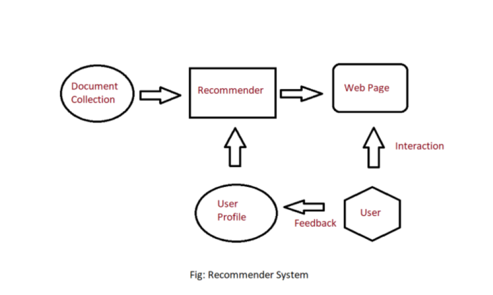

# 🎬Movie Recommender System

A Web Base user-item Movie Recommendation Engine using Content Based  Filtering. A Content-Based Recommender works by the data that we take from the user, either explicitly (rating) or implicitly (clicking on a link). By the data we create a user profile, which is then used to suggest to the user, as the user provides more input or take more actions on the recommendation, the engine becomes more accurate.

The details of the movies(title, genre, runtime, rating, poster, etc) are fetched using an API by TMDB, https://www.themoviedb.org/documentation/api, and using the IMDB id of the movie in the API

## How to run the project?

1. Clone this repository in your local system `git clone https://github.com/darthdaenerys/Movie-Recommender-System.git`.
2. `cd Movie-Recommender-System`
3. Create a new virtual environment on that directory `virtualenv .`
4. Activate Your Virtual Environment
    - for Linux `for Linux`
    - for Windows `cd Scripts` then `activate`
5. Install all the libraries mentioned in the requirements.txt file with the command `pip install -r requirements.txt`
6. Open your terminal/command prompt from your project directory and type `streamlit run app.py`
7. Hurray! That's it.

## Similarity Score

How does it decide which item is most similar to the item user likes? Here come the similarity scores.

It is a numerical value ranges between zero to one which helps to determine how much two items are similar to each other on a scale of zero to one. This similarity score is obtained measuring the similarity between the text details of both of the items. So, similarity score is the measure of similarity between given text details of two items. This can be done by cosine-similarity.

## How Cosine Similarity works?

Cosine similarity is a metric used to measure how similar the documents are irrespective of their size. Mathematically, it measures the cosine of the angle between two vectors projected in a multi-dimensional space. The cosine similarity is advantageous because even if the two similar documents are far apart by the Euclidean distance (due to the size of the document), chances are they may still be oriented closer together. The smaller the angle, higher the cosine similarity.

## Sources of the datasets

TMDB 500 dataset [link](https://www.kaggle.com/datasets/tmdb/tmdb-movie-metadata)
